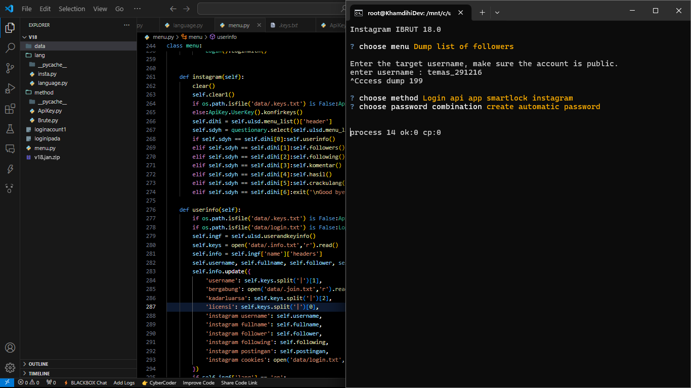

<div align="center">  </div> <h1 align="center" style="font-family: 'Roboto', sans-serif; font-size: 3em; color: #1E88E5; text-shadow: 2px 2px 4px rgba(0,0,0,0.5);"> <b>Instagram Bruteforce 2025</b> </h1> <div align="center">      </div> <p align="center" style="font-family: 'Arial', sans-serif; font-size: 1.2em; color: #E53935; margin-top: 20px;"> <i>⚠️ Please Note: If you purchase this license or file from others, you are fully responsible for any issues. The developer assumes no liability!</i> </p>


### ✨ What's New?
  - 🐍 Full support for Python 3.12.x.
  - 🎨 Sleek and modern interface.
  - 📖 Step-by-step installation guide for beginners.
  - 🔑 New login methods:
     - Api v1
     - API Async Action
     - API Google SmartLock
  - 🌐 Dual language support: English & Indonesia.

### 🚀 Install on termux
```
pkg install git python -y
pip3.12 install requests pycryptodomex questionary
git clone https://github.com/khamdihi-dev/Prem
cd Prem
python3.12 menu.py
```

### If you have installed it
```
cd $HOME
cd Prem
python3.12 menu.py
```

### Display


🎥 Watch Tutorial on YouTube
<div align="center"> <a href="https://www.youtube.com/@khamdihidev" target="_blank"> </a> </div>

